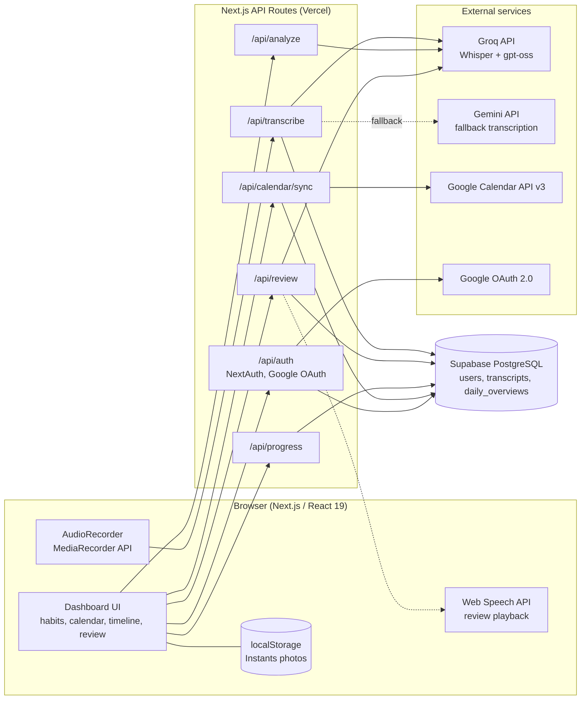
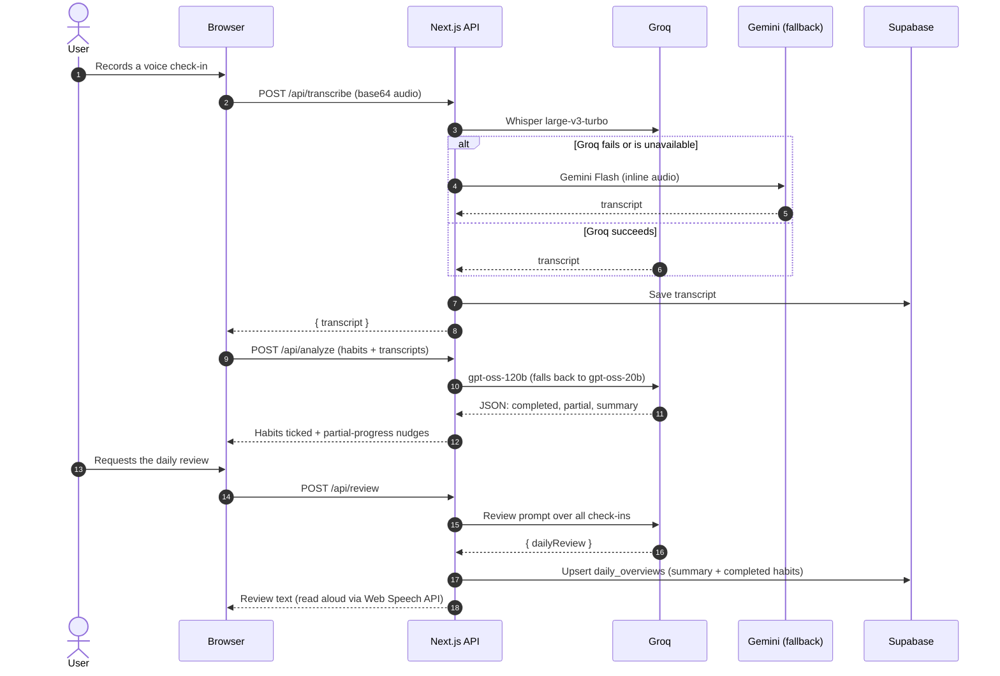

<div align="center">


# CasualHealth

### Small habits. Bigger you.

**A voice-first habit tracker. Talk about your day, and AI ticks off your habits, syncs your calendar and writes your daily review.**

[](https://github.com/TheShreyank/ASYNC-26/actions/workflows/ci.yml)


[](LICENSE)


[**Live Demo**](https://async-26.vercel.app/) &nbsp;·&nbsp; [**Demo Video**](YOUR_DEMO_VIDEO_URL) &nbsp;·&nbsp; [Architecture](#2-architecture--system-design) &nbsp;·&nbsp; [Quick Start](#3-installation--configuration) &nbsp;·&nbsp; [Security](SECURITY.md)

</div>

---

## Table of Contents

1. [Context & Overview](#1-context--overview)
2. [Architecture & System Design](#2-architecture--system-design)
3. [Installation & Configuration](#3-installation--configuration)
4. [Developer Experience & Quality Control](#4-developer-experience--quality-control)
5. [Reliability, Performance & Security](#5-reliability-performance--security)
6. [Governance & License](#6-governance--license)

---

## 1. Context & Overview

### The problem

Habit trackers fail at the same point: logging. Opening an app, finding the right checkbox and ticking it every day is friction, and people quit within weeks.

### The solution

**CasualHealth replaces checkboxes with a 30-second voice note.** Say what you did today in your own words. The app transcribes your recording, works out which habits you completed, flags partial progress with a motivating nudge, cross-checks your Google Calendar, and closes the day with a short AI-written review that it can read back to you.

**Who it's for:** anyone building daily routines who wants tracking to take seconds rather than minutes, for example students and busy professionals.

### Core features

| | Feature | What it does |
|---|---|---|
| 🎙️ | **Voice check-ins** | Record in the browser, then transcribe with Groq Whisper (`whisper-large-v3-turbo`). Falls back to Gemini Flash if Groq is unavailable. |
| 🧠 | **AI habit detection** | An LLM (`gpt-oss-120b`, falling back to `gpt-oss-20b`) matches your transcripts against your habit list and returns structured JSON: completed habits, partial progress and a summary. |
| 🔔 | **Partial-progress nudges** | Said "I read 5 pages" against a 20-page goal? You get an in-app motivational push instead of a silent miss. |
| 📅 | **Google Calendar sync** | Pulls today's events via the Google Calendar API. Events are marked done once they have ended or when you mention them in a check-in. |
| 🔊 | **Daily review with playback** | Generates a concise, encouraging review of your whole day and reads it aloud with the browser's text-to-speech. |
| 📊 | **Progress analytics** | A `/progress` page shows total habits completed and a weekly consistency chart (Recharts). |
| 📸 | **Instants** | A lightweight photo journal captured from your camera, stored on-device. |
| 🌿 | **Responsive green UI** | A custom leaf-inspired design system with automatic light and dark themes, built for desktop and mobile. |

### Demo & screenshots

> **Live app:** https://async-26.vercel.app/ &nbsp;|&nbsp; **Video walkthrough:** [Watch the demo](YOUR_DEMO_VIDEO_URL)

| Dashboard | Voice check-in |
|:---:|:---:|
|  |  |
| **Calendar & timeline** | **Progress analytics** |
|  |  |

---

## 2. Architecture & System Design

### System architecture



### End-to-end execution flow (voice check-in to daily review)



### Project structure

```text
ASYNC-26/
├── frontend/                    # The Next.js application
│   ├── app/
│   │   ├── page.js              # Dashboard (habits, calendar, timeline, review)
│   │   ├── progress/page.js     # Weekly consistency chart + totals
│   │   └── api/
│   │       ├── transcribe/      # Audio to text (Groq Whisper, Gemini fallback)
│   │       ├── analyze/         # Transcripts to completed/partial habits
│   │       ├── review/          # AI daily review, persisted to Supabase
│   │       ├── progress/        # Weekly chart data
│   │       ├── calendar/sync/   # Today's Google Calendar events
│   │       └── auth/            # NextAuth (Google OAuth)
│   ├── components/              # AudioRecorder, CameraBox, Providers
│   ├── lib/                     # retry.js (backoff), supabase.js (client)
│   └── public/                  # Logos and static assets
├── .github/workflows/ci.yml     # Lint, test, build
├── SECURITY.md                  # Vulnerability disclosure policy
└── LICENSE
```

### Documentation links

| Resource | Link |
|---|---|
| Live application | https://async-26.vercel.app/ |
| Groq API reference | https://console.groq.com/docs |
| NextAuth.js (Google provider) | https://next-auth.js.org/providers/google |
| Google Calendar API v3 | https://developers.google.com/calendar/api/v3/reference |
| Supabase docs | https://supabase.com/docs |
| Next.js docs | https://nextjs.org/docs |

> This project exposes internal Next.js route handlers rather than a public API, so there is no OpenAPI spec. Request and response shapes are documented in [Usage](#usage-snippets).

---

## 3. Installation & Configuration

### Prerequisites & tech stack

| Requirement | Version / notes |
|---|---|
| **Node.js** | `>= 20.9` (22 LTS recommended, used in CI) |
| **npm** | `>= 10` |
| **Hardware** | Standard laptop. No GPU needed, since all AI inference runs on hosted APIs. |
| **Browser** | Current Chrome, Edge or Safari with microphone access (needs `localhost` or HTTPS) |

**Stack**

| Layer | Technology |
|---|---|
| Framework | Next.js 16 (App Router), React 19 |
| Styling | Custom CSS design system, Tailwind CSS 4 (PostCSS) |
| Speech-to-text | Groq `whisper-large-v3-turbo`, with Gemini Flash fallback |
| LLM analysis & review | Groq `openai/gpt-oss-120b`, falling back to `openai/gpt-oss-20b` |
| Auth | NextAuth.js 4 with Google OAuth 2.0 |
| Database | Supabase (PostgreSQL) |
| Calendar | Google Calendar API v3 (`googleapis`) |
| Charts / icons | Recharts, Lucide React |

**Accounts you will need (all have free tiers):** [Groq](https://console.groq.com), [Supabase](https://supabase.com), [Google Cloud Console](https://console.cloud.google.com) (OAuth client + Calendar API), and optionally [Google AI Studio](https://aistudio.google.com) for the Gemini fallback key.

### Step-by-step installation

```bash
# 1. Clone the repository
git clone https://github.com/TheShreyank/ASYNC-26.git
cd ASYNC-26/frontend

# 2. Install dependencies
npm install

# 3. Create your environment file, then fill in the values (see the matrix below)
cp .env.example .env.local

# 4. Start the development server
npm run dev
```

Open **http://localhost:3000** and allow microphone access when prompted.

**One-time service setup**

1. **Groq:** create an API key at console.groq.com and set `GROQ_API_KEY`.
2. **Supabase:** create a project, then run the [schema SQL](#database-schema) in the SQL editor. Copy the project URL and the `service_role` key.
3. **Google OAuth:** in Google Cloud Console, enable the **Google Calendar API**, create an **OAuth 2.0 Client ID** (Web application) and add this authorized redirect URI:
   `http://localhost:3000/api/auth/callback/google`
4. Generate a NextAuth secret: `openssl rand -base64 32`

**Production build**

```bash
npm run build
npm start
```

### Environment variables matrix

Define these in `frontend/.env.local`. A template lives at [`frontend/.env.example`](frontend/.env.example).

| Variable | Description | Type | Default | Required |
|---|---|---|---|:---:|
| `GROQ_API_KEY` | Groq key used for transcription, habit analysis and daily review | `string` | none | ✅ |
| `GEMINI_API_KEY` | Google Gemini key, used only as a transcription fallback | `string` | none | ➖ optional |
| `NEXTAUTH_SECRET` | Secret used by NextAuth to sign session tokens | `string` | none | ✅ |
| `NEXTAUTH_URL` | Canonical app URL, also used to build the OAuth callback | `url` | `http://localhost:3000` | ✅ in production |
| `GOOGLE_CLIENT_ID` | Google OAuth 2.0 client ID | `string` | none | ✅ |
| `GOOGLE_CLIENT_SECRET` | Google OAuth 2.0 client secret | `string` | none | ✅ |
| `NEXT_PUBLIC_SUPABASE_URL` | Supabase project URL | `url` | none | ✅ |
| `SUPABASE_SERVICE_ROLE_KEY` | Supabase service-role key. **Server-side only, never expose to the client.** | `string` | none | ✅ |
| `NEXT_PUBLIC_SUPABASE_ANON_KEY` | Supabase anon key, used only if the service-role key is absent | `string` | none | ➖ optional |

### Database schema

<details>
<summary><b>Supabase SQL (click to expand)</b></summary>

```sql
create table if not exists users (
  id                    uuid primary key default gen_random_uuid(),
  email                 text unique not null,
  name                  text,
  google_access_token   text,
  google_refresh_token  text
);

create table if not exists transcripts (
  id          bigint generated always as identity primary key,
  transcript  text not null,
  created_at  timestamptz default now()
);

create table if not exists daily_overviews (
  id                bigint generated always as identity primary key,
  user_id           text not null,
  date              date not null,
  summary           text,
  completed_habits  jsonb default '[]'::jsonb,
  unique (user_id, date)
);
```

</details>

---

## 4. Developer Experience & Quality Control

### Usage snippets

All endpoints are JSON over HTTP and live under `frontend/app/api/`.

**Transcribe audio** &mdash; `POST /api/transcribe`

```bash
curl -X POST http://localhost:3000/api/transcribe \
  -H "Content-Type: application/json" \
  -d '{"audio": "<base64-encoded-audio>", "mimeType": "audio/webm"}'
# → { "transcript": "I woke up at six and went to the gym..." }
```

**Analyze check-ins against habits** &mdash; `POST /api/analyze`

```bash
curl -X POST http://localhost:3000/api/analyze \
  -H "Content-Type: application/json" \
  -d '{
        "habits": ["Wake up at 6 a.m.", "Go to the gym", "Read 20 pages"],
        "logs":   ["Woke up at 6, hit the gym, and read about 5 pages."]
      }'
# → {
#     "completedHabits": ["Wake up at 6 a.m.", "Go to the gym"],
#     "partialHabits":   [{ "name": "Read 20 pages", "message": "..." }],
#     "cumulativeSummary": "..."
#   }
```

**Generate the daily review** &mdash; `POST /api/review`

```bash
curl -X POST http://localhost:3000/api/review \
  -H "Content-Type: application/json" \
  -d '{"logs": ["..."], "habits": [{"name": "Go to the gym", "completed": true}]}'
# → { "dailyReview": "Great day! ..." }
```

**Other routes:** `GET /api/calendar/sync` (today's events, requires sign-in) and `GET /api/progress` (weekly chart data).

### Testing & QA commands

Run everything from the `frontend/` directory.

```bash
npm test          # Unit tests (Node's built-in test runner): retry/backoff logic
npm run lint      # ESLint (eslint-config-next, React Hooks rules)
npm run build     # Production build, doubles as a type and compile check
```

| Check | Command | Status |
|---|---|---|
| Unit tests | `npm test` | ✅ 5 passing (`lib/retry.test.mjs`) |
| Lint | `npm run lint` | ⚠️ 2 known `react-hooks` errors, tracked in [Known limitations](#troubleshooting--known-limitations) |
| Build | `npm run build` | ✅ Runs in CI on every push and pull request |

The same three checks run automatically via [GitHub Actions](.github/workflows/ci.yml).

---

## 5. Reliability, Performance & Security

### Maturity status

**Beta.** The core loop (voice, transcription, habit detection, review) is deployed and working. Persistence, authorization hardening and test coverage are still maturing. See the limitations below.

### Benchmarks & resilience

Latency measured on the deployed Vercel app, median of 5 runs with a ~20 second voice note:

| Operation | Median latency |
|---|---|
| `POST /api/transcribe` (Groq Whisper) | `X.X s` |
| `POST /api/analyze` | `X.X s` |
| `POST /api/review` | `X.X s` |
| End-to-end (stop recording to habits ticked) | `X.X s` |

**Built-in resilience**

| Mechanism | Behaviour |
|---|---|
| Retry with exponential backoff | Retries `429` / `503` responses, with delays starting at 1 s and doubling |
| Model fallback | Analysis and review fall back from `gpt-oss-120b` to `gpt-oss-20b` on rate limits |
| Transcription fallback | Groq Whisper first, then Gemini Flash |
| Input validation | Rejects malformed bodies (`400`) and recordings over 25 MB (`413`) |

### Troubleshooting & known limitations

**Common setup errors**

| Symptom | Likely cause | Fix |
|---|---|---|
| `Groq API key is not configured on the server` (503) | `GROQ_API_KEY` missing | Add it to `frontend/.env.local` and restart `npm run dev` |
| `All Groq models are currently rate-limited` (429) | Free-tier rate limit hit | Wait a minute and retry. The app already retries and falls back automatically. |
| Microphone doesn't start | Permission denied, or page not on `localhost` / HTTPS | Allow the mic in the browser's site settings |
| Google sign-in shows `redirect_uri_mismatch` | Callback URL not registered | Add `http://localhost:3000/api/auth/callback/google` to the OAuth client's redirect URIs |
| Calendar shows no events or returns `401` / `404` | Not signed in, Calendar API not enabled, or no `users` row | Sign in with Google, enable the Calendar API, and confirm the schema exists |
| Sign-in fails with a database error | Supabase tables not created | Run the [schema SQL](#database-schema) |
| `The recording is too large` (413) | Recording over 25 MB | Record a shorter check-in |

**Known limitations & trade-offs**

| Area | Limitation | Planned / workaround |
|---|---|---|
| Habit persistence | The habit list and today's check-ins live in client state and reset on refresh. Only transcripts and daily reviews are saved. | Persist habits per user in Supabase |
| Demo data | `/api/progress` fills the chart with **sample data** when no daily reviews are saved yet (or only one day exists), so the chart isn't empty during demos. | Remove the padding for production |
| Streak card | The "Current Streak" card on `/progress` is a static placeholder and is not calculated from your history yet. | Compute from `daily_overviews` |
| Anonymous usage | Requests without a session are attributed to a shared `demo_user_123` for reviews and progress. | Require sign-in for persisted data |
| Database access control | The server uses the Supabase service-role key (which bypasses Row Level Security), so access control is enforced in the API routes, not by database policies. | Add RLS policies and use per-user JWTs |
| Token storage | Google OAuth tokens are stored in the `users` table without application-level encryption. | Encrypt at rest or use Supabase Vault |
| Third-party processing | Voice recordings and transcripts are processed by Groq (and Gemini on fallback) under their own terms. | Disclose in the UI, and offer an opt-out |
| Lint | `npm run lint` reports 2 errors (`react-hooks/immutability` in `app/page.js`, `react-hooks/set-state-in-effect` in `components/CameraBox.js`). Neither affects runtime behaviour. | Refactor those hooks |
| Photo journal | Instants are stored in `localStorage` only (per device, size-limited). | Move to Supabase Storage |
| Free-tier APIs | Heavy use can hit provider rate limits. | Add a paid key or request queueing |

> CasualHealth is a habit-tracking tool for general wellbeing. It is not a medical device and does not provide medical advice.

### Security reporting

Found a vulnerability? **Please don't open a public issue.** Report it privately through GitHub's
[**Report a vulnerability**](https://github.com/TheShreyank/ASYNC-26/security/advisories/new) form. Full details are in [SECURITY.md](SECURITY.md).

---

## 6. Governance & License

### Contributing

Contributions are welcome.

1. Fork the repo and create a branch: `git checkout -b feat/your-feature`
2. Follow the existing style. ESLint (`eslint-config-next`) is the source of truth, so run `npm run lint` and `npm test` before committing.
3. Use clear, imperative commit messages (for example, `Add habit persistence to Supabase`).
4. Open a pull request describing the change and how you tested it.

**Code style:** functional React components with hooks, ES modules, API route handlers under `app/api/`, and no secrets in source. Environment values belong in `.env.local`, which is git-ignored.

### License

Released under the [MIT License](LICENSE) © 2026 Shreyank.

### Acknowledgements

Built for **ASYNC'26** by the **Junction Junkers** team. Powered by [Next.js](https://nextjs.org), [Groq](https://groq.com), [Supabase](https://supabase.com), [Recharts](https://recharts.org) and [Lucide](https://lucide.dev).

<div align="center">

**Small habits. Bigger you.** 🌿

</div>
